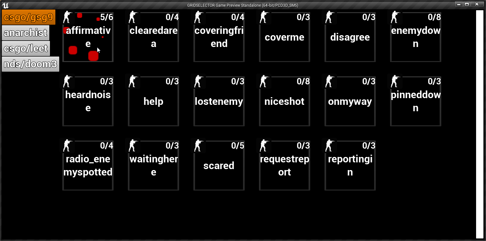

# GRIDSELECTOR

  

u load it on ur phone that hab usb-debugging enabled using ue4 editor launch button and then pipe phone audio to caputer, and use audio in discord or something.  
im had 3.5mm from phone to line-in on the wiggled SOUNDBLASTER XFI PLATNIUM!!!! and my discord voice-activated on line-in. so when im press button on phone it say it in discord  

to make more character u need put sound files in _Content\Sounds\gameNameHere\characterNameHere_  
then ur add entries manually in CharacterTypes datatable  
im want in future to do away with the datatable and just read shit from directories Ful blown but one day...  

files like affirmative_1.wav, affirmative_2.wav, affirmative_urMum.wav, only need the one entry "affirmative"  
but watch out for other types of files with affirmative in the name, cause it will also include moveout_affirmative_01 set of sounds as wel.  
if that the case ur need manually rename one set of filez.

_this was done in ue4 cause i dont know how the frik to make android apps, and ue4 has 1 click deployment to android phone  
im use phone cause it have touchscreen so i can touch the buttons while hand still on mouse to aim._